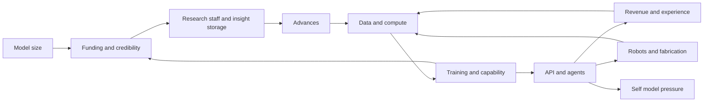

# Singular Value game analysis

This analysis explains how [Keir Finlow-Bates’s Singular Value](https://singularvalue.org/) works, why its progression is effective, where its implementation and scientific storytelling simplify reality, and which design principles should carry into a quantum computing game made as a surprise gift for him. The central recommendation is to preserve its changing bottlenecks, research discoveries, automation, humor, and dramatic progression while giving the new game its own scientific model and a much richer visual identity.

The proposed adaptation and visual brief are in [QUANTUM-DESIGN.md](QUANTUM-DESIGN.md). Primary academic sources are collected in [PAPERS.md](PAPERS.md). Every existing advance, prerequisite, cost, and effect is listed in [original-project-inventory.md](original-project-inventory.md). The independent quantum review and agreed changes are recorded in [REVIEW.md](REVIEW.md).

## Scope and evidence

The source was retrieved on 4 October 2026 from the public website. The response reported a last-modified date of 2 October 2026. The unmodified snapshot, [original-game.html](original-game.html), contains 107,392 bytes and 1,400 lines. Its SHA-256 is `a386c26313cb73a77ef8d03cd9cfcea363ac85355099e83af422841dad93b796`.

The analysis covers both inline scripts, all state fields, derived quantities, player actions, projects, event systems, persistence, rendering, themes, and endings. The DOM-free engine was executed in a Node VM for numerical checks and an accelerated playthrough using legal actions and resource costs. Browser observations cover the opening desktop interface and later states taken from that simulation. Captured states are identified as such; they are not evidence of a human playing through the whole campaign.

The workspace initially contained no files and was not a Git repository. This phase adds research artifacts and audit tools, not the new playable game. No contact with Keir, public posting, or deployment has occurred.

| Item | Confirmed count or behavior |
| --- | --- |
| Inline JavaScript scripts | 2, separating engine and UI |
| Advances | 84, including both alternatives in each fork |
| Advances with an external reference | 58 |
| Reference destinations | 53 Wikipedia links and 5 arXiv links |
| Mutually exclusive decisions | 3 binary pairs |
| Engine actions | 16 |
| Initial state fields | 89, with additional fields created during play |
| Identity levels | 10 |
| Visual eras | 7 |
| Satirical executive news items | 48 |
| Endings | Awake and The Unwitnessed |
| Audit scenario checks | 13 passed |

The user's supplied rules govern this work. The bibliography is a curated research foundation for the adaptation, rather than an exhaustive survey of every quantum computing paper or a claim about the newest hardware record.

## Authorship and intended experience

Keir’s [launch article](https://blockchaingandalf.substack.com/p/singular-value-ff6), dated 1 October 2026, identifies Universal Paperclip as the inspiration. It describes an AI-development game beginning with nodes, layers, training, and hardware, then moving into invented advances and a strange future. The changing interface eras and the aim of avoiding consciousness were deliberate parts of that brief.

That explains several otherwise unusual choices. The player is the evolving intelligence itself, rather than a business manager standing outside it. Real academic names give the first half a recognizable history; invented researchers and machine names make the later stages feel alien. The Bitcoin economy eventually connects software growth to physical control. The failure ending gives the apparently desirable emergence of awareness a threatening meaning within the story.

The launch article reflects the original brief. The downloaded source includes later mechanics and is the authoritative evidence for this analysis. Its displayed years do not establish a strict historical sequence.

## The core progression

The smallest loop is straightforward: add neurons, receive funding and credibility, allocate researchers and notebooks, accumulate insight, and buy advances. Each advance either changes a production multiplier or unlocks a new kind of decision. Larger loops successively surround that one.

Its strongest pattern is that a successful investment creates the next shortage. Adding neurons eventually fills memory. Increasing model size makes training and serving slower at fixed compute. Faster training exhausts the dataset. Agents accelerate research and experience but consume the compute that could serve customers. Manufacturing GPUs eventually requires enough solar power. Avoiding awareness costs compute. This is why a collection of counters becomes an engaging systems game.

Automation is also progression. Early clicks become graduate-student and lab production. Scaling laws eventually grow the model automatically. Learning-rate schedules remove a maintenance task. Pricing automation removes another. Agents later produce research. The player is rewarded by graduating from an old decision to a new one.

## All seven eras

| Era | Displayed year | Exact transition | Main new experience | Interface |
| --- | --- | --- | --- | --- |
| 0 | 1983 | Starting state | Neurons, grants, research, memory, layers, training | Black terminal with green phosphor text and amber console |
| 1 | 1995 | Purchase LeCun convolutional networks | Deeper learning, more productive staff, web data | Teal Windows 95 desktop with beveled panels |
| 2 | 2006 | Purchase CUDA | GPU compute and memory, larger datasets, Bitcoin prerequisites | Blue and silver glossy panels |
| 3 | 2015 | Purchase AlexNet | Public API, commercial pricing, open or closed weights, transformer efficiencies | Material Design typography and cards |
| 4 | 2024 | Purchase scaling laws | Automatic model growth, datacenters, chat, agents, experience, self-model risk | Restrained modern rounded cards |
| 5 | 2033 | Purchase Moravec’s outside | Robots, fabs, solar, physical expansion, quantum treasury event | Dark purple futuristic interface |
| 6 | after | Purchase substrate conversion | Invented machine discoveries and final growth | Sparse interface headed by the sigma symbol |

Era is an irreversible state variable. Identity is another irreversible ladder, and the two need not advance together. An era change updates the CSS tokens, title, year flash, and musical cue. Some projects can therefore be bought while a theme associated with another period is active.

The ten identities are perceptron, expert system, deep network, language model, assistant, agent, swarm of agents, actor in the world, something without a name, and the Unwitnessed. Each is reached through a named project rather than a continuously evaluated intelligence classification.

## Model and hardware

Let `w = floor(width)` and `L = layers`. The parameter count is:

`N = w²(L − 1) + w`.

The first layer therefore grows linearly with width; subsequent layers make width increasingly expensive. The displayed depth efficiency is `L/(L+8)`, a game modifier applied to the model-size term in the loss equation. This is a pedagogical proxy for the value of depth, not a measured universal architectural law.

The initial machine has 64 KiB of memory, 4 bytes per weight, and 5 billion FLOP/s. That permits 16,384 initial parameters. CPU memory can be doubled five times to 2 MiB. Buying a layer consumes funding and may reduce width if the resulting parameter count exceeds available memory. Adding neurons is free but checked against the memory limit.

One initial GPU supplies 5 trillion FLOP/s and 16 billion bytes of VRAM. A datacenter supplies the equivalent of 1,000 GPUs. Three generation upgrades each multiply GPU compute by four. Other advances multiply FLOP throughput or VRAM capacity. These are game constants rather than real historical device specifications.

Available memory is CPU memory plus GPU-equivalent count times VRAM per GPU. Maximum model size is memory divided by bytes per parameter. Quantization therefore expands capacity without buying more memory: 4 bytes become 2, then 1, then 0.5, then 0.2. The last value is a rounded game representation of ternary weights.

The mixture-of-experts advance changes active parameters to `max(1,N/8)`. Training and serving costs use active parameters while memory and loss continue to use total parameters. This creates an unusually powerful efficiency breakthrough by making a larger model cheaper to run without reducing its size-based capability benefit.

Manual pruning halves width, not parameter count. With multiple layers, that can remove roughly three quarters of the quadratic parameter component. The interface wording is accurate about neurons but a player thinking in parameters could easily misread the effect.

Graduate students add 0.5 width units per second before multipliers; labs add 25. Manual clicks initially add one neuron and become two after the first advance. Fractional growth accumulates internally, but the displayed parameter calculation floors width.

After scaling laws, automatic growth targets about 20 trained tokens per parameter, subject to memory. It only grows toward the target: it does not shrink a model that is already too large. The staff panel hides while that automation is enabled. Manual growth can be restored through the checkbox.

## Research and credibility

Research has three separate constraints: production rate, storage capacity, and the idea currency. Researchers produce 4 insight per second each, multiplied by advances. Notebooks store 1,000 insight each, multiplied by capacity advances. Neither staff type has a monetary cost; each occupies one credibility point.

Credibility is the sum of five milestone pools:

| Pool | Thresholds | What the game rewards |
| --- | --- | --- |
| Model size | Fibonacci sequence beginning 3, 5, 8, 13 | Larger models |
| Capability | 10, 20, 40, 80 and successive doubling | Better benchmark scores |
| Training | 100,000 tokens, then three times as many each milestone | More training |
| Lifetime funding | $1,000, then ten times as much each milestone | Funding rounds |
| Project awards and penalties | Explicit effects | Academic advances, openness, or hype collapse |

Milestones are retained after pruning or loss of capability. Credibility already earned from model size and tokens is not recalculated downward. Hype collapse can directly reduce the project pool and remove staff.

The starting state has one researcher and one notebook but zero earned credibility, so available credibility is −2. Growth to the first two size thresholds merely brings that balance to zero. The game works, but this is a confusing opening signal that the adaptation should eliminate.

Ideas begin after Hebb. Their base rate is `0.08 × researchers^1.2 × ideaMult`. A full insight store multiplies that rate by four. This creates a real choice: buying an advance reduces insight and temporarily gives up the full-store idea bonus. Purchasing more storage can similarly reduce the time spent at maximum insight.

Agents eventually add insight at `agentWork` per second and ideas at `0.5 × agentWork` per second. This changes the research economy from staff-limited production to compute-limited production.

Capacity advances multiply notebook storage by 1.5, 2, 2, 2.5, then 10, for a combined factor of 150 if all are purchased. Before the Sieve’s final tenfold increase, an 800,000-insight advance needs at least 54 notebooks at the preceding maximum factor of 15. This is why late research requires planning beyond simply hiring more researchers.

Staff cannot be voluntarily reassigned or removed. An audit policy that allocated every spare point to researchers reached 24 notebooks and 144,000 insight capacity, then stalled at the 150,000-insight ReAct advance for the remainder of a 20-hour simulation. Unbounded lifetime funding can eventually yield more credibility, so this is not proof of a permanent deadlock. It is evidence of a severe allocation trap. Reserving three free credibility points let a revised policy continue to the ending.

## Training and capability

Training unlocks with backpropagation. The loss model is:

`loss = 1.69 + 406.4/(N × depthEff)^0.34 + 410.7/tokens^0.28`, with denominators floored at one.

Pretraining capability is `100/(loss − 1.6)`. Before the training flag is enabled, capability is zero. Later, experience multiplies it by `1 + sqrt(xp/1,000,000)`.

The coefficients and power-law form resemble the empirical fit in [Hoffmann et al.’s compute-optimal language-model paper](https://arxiv.org/abs/2203.15556). The game adds a depth modifier, converts loss into a capability score, and eventually multiplies that score through agent experience. These additions are gameplay abstractions. The approximately 20-token rule should also be read as a simplified training regime, not a universal optimum for every model or deployment. [Kaplan et al.](https://arxiv.org/abs/2001.08361) provide the earlier scaling-law context.

At fixed effective compute, training speed is proportional to compute and inversely proportional to active model parameters:

`tokens/s = F × trainingShare × trainingEfficiency × learningRateGain / (6 × activeParameters)`.

Training tokens are capped by the dataset. The initial dataset is one million tokens. ImageNet adds one billion in this model, despite being an image dataset in reality. Crawlers add public-web tokens up to a fixed cap of three trillion. Synthetic data later grows at ten million tokens per unit of agent work per second and removes the finite-web bottleneck.

The data model counts tokens as a stock that can be used once. It does not model epochs, quality, duplication, contamination, or degradation from synthetic data. Its purpose is to make data supply a clear resource limit.

There is also a mathematical ceiling before experience. As size and trained tokens approach infinity, the loss approaches 1.69, so pretraining capability approaches about 1,111. The final project needs capability at least 100,000. Experience is therefore an essential route past the pretraining regime, not an optional multiplier that can be replaced by enough parameters.

## Learning-rate control and recovery

The learning-rate slider stores a base-10 logarithm. Its optimal logarithm falls with size: `−1.5 − 0.35 log10(N)`. The ratio of actual to optimal learning rate determines speed, the gradient-norm display, and divergence risk.

Below the optimum, speed is proportional to `ratio^0.8`. Above it, the gain approaches only 1.6 while divergence hazard grows quadratically as `0.05(ratio−1)²/stability`. This is an effective risk-reward curve: a small possible speed benefit comes with increasing instability.

A loss spike removes 15% of accumulated tokens and initiates a 12-second restore. Training stops during the restore and serving capacity halves. Initialization, Adam, and layer normalization reduce the risk through stability multipliers. Glorot initialization requires at least one spike; layer normalization requires at least two. Those gates intentionally reward having encountered a failure.

The engine continues sampling divergence during checkpoint restoration. A sufficiently high rate can therefore trigger repeated spikes and reset the recovery timer, rather than producing one isolated failure and a guaranteed recovery. The audit reproduced two consecutive spikes with the timer reset to 11.5 seconds after each half-second step.

Learning-rate schedules set the rate to 90% of the computed optimum. Despite the project’s cosine-schedule description, the implementation does not model an actual warmup and cosine decay trajectory. It automates a changing safety target.

The tiny loss plot is a presentation effect: it adds unsaved random noise and a temporary restore bump to the calculated loss. Its vertical coordinates increase with larger loss, so higher loss appears lower in the SVG. There are no axis labels to explain that inversion. It is not a graph of separately measured training outcomes.

## Funding and the hype system

Funding is generated continuously through grants and, later, API revenue. Starting grants are $0.30 per second even before the first click. Money is not a scarce opening prerequisite for taking the first action.

Hype is `1.15^pressLevel × hypeMult`. Press releases cost `30 × 2^pressLevel`, so repeated announcements rapidly become expensive. Several major projects multiply hype independently of press level.

Before an API, grants are proportional to `log2(N+1)^1.5 × hype × (1+capability)`. After an API, the final capability term is replaced by a factor of five. Launching an API can therefore reduce grants for a capable model, while introducing earned revenue. A player should consider the whole income change rather than assuming every unlock increases every rate.

The hype bubble compares press expectations, `1.15^pressLevel`, with an allowance of `1 + sqrt(results)`. Results are capability once training exists and `log2(N+1)` earlier. Research-driven hype multipliers are absent from the expectation numerator. Huge hype bonuses from chat or AlexNet can boost funding without directly increasing this bubble ratio.

If expectations exceed allowance, the bubble fills at a rate proportional to the excess. Otherwise it drains at 0.01 per second. When full, it halves press level, triggers a 120-second winter, loses two credibility, and removes researchers before notebooks until the allocation fits or minimum staff is reached. Grants fall to 20% and demand to 30% during a winter. Minimum staff can still leave credibility overallocated.

A separate historical winter begins after the perceptron advance when width reaches 30 without the layers project. It lasts until that project is purchased; it is not the same timer-based event as a hype winter. The source permits the player to unlock layers before that event and avoid it entirely.

The adaptation should preserve the gap between claimed performance and measured results, while making the relevant measurements visible and avoiding opaque penalties.

## API allocation and pricing

The API introduces two decisions: the training-versus-serving split and the price per request. Training uses all compute before the API; afterward the allocation slider controls the split.

Serving capacity is proportional to serving compute and inference efficiency, divided by twice the active parameter count and an assumed 1,000-token request. This makes larger models more capable but also more expensive to serve.

Fair price is `min(20,0.01 × max(1,capability)^1.5) × fairPriceMultiplier`. Demand grows with hype and capability and falls with price using an elasticity of 1.5. The game caps actual demand at 100 million requests per second. Revenue is delivered requests times actual price, not all incoming demand.

Agents consume serving capacity before customers. Available customer capacity is total serving capacity minus running agents. It can reach zero even while demand and a nominal price look healthy. This gives agent deployment an opportunity cost rather than allowing a free second production engine.

The pricing automation solves for a price that fills spare capacity under the game’s demand curve. It is described as a Vickrey auction, but there are no individual bids, second-price rule, or actual auction process. It is capacity-matching automated pricing.

The source permits the automated logarithmic price to fall below the manual slider’s minimum. At extreme states, the disabled slider cannot faithfully represent the internally chosen value. This is an implementation mismatch worth avoiding in a new interface.

## Every player action and its role

| Action | Cost or constraint | Strategic purpose |
| --- | --- | --- |
| Add neuron | Free; requires memory headroom | Opening growth and manual control |
| Add layer | `$25 × 1.6^(layers−1)`; layers unlock | Increase depth, with possible width shrink |
| Prune half | Training unlock and width at least 4 | Trade size for throughput |
| Hire grad student | `$10 × 1.14^grads` | Automate width growth |
| Found lab | `$2,500 × 1.12^labs`; lab unlock | Larger growth production |
| Press release | `$30 × 2^pressLevel` | Increase funding and demand at bubble risk |
| Upgrade memory | `$40 × 2^ramLevel`; maximum five | Early memory expansion |
| Buy GPU | `$3,000 × 1.03^gpus`; GPU unlock | Compute and memory together |
| Build datacenter | `$2,000,000 × 1.15^dcs × costMultiplier` | Hardware in blocks of 1,000 GPUs |
| Buy crawler | `$200 × 1.12^crawlers`; web cap | Increase data supply |
| Deploy agents | `$1,000,000,000 × 1.2^agentPurchases` | Buy `floor(10 × 1.3^purchases)` agents |
| Acquire robots | Dollar price converted to BTC | Buy `floor(100 × 1.06^purchases)` robots |
| Buy BTC | Half available funds; supply cap | Build treasury for physical expansion |
| Sell BTC | Half holdings | Convert treasury back to funding |
| Add researcher | One available credibility | Increase insight and idea production |
| Add notebook | One available credibility | Increase insight storage |

Project purchases are separate from these 16 engine actions. Most projects spend insight, some also spend ideas or funding. An advance can become visible before it is affordable. Affordability and prerequisites are checked by the engine as well as by disabled UI controls. A purchased project cannot be purchased again.

## The three forks

| Decision | Benefits | Tradeoff |
| --- | --- | --- |
| Open weights | Fourfold hype and three credibility | Fair API price halves |
| Closed weights | Fair API price doubles | Forego openness rewards |
| Pause letter | Self-model pressure later reduced by 40% | Datacenters cost 30% more and hype falls 30% |
| Race | Datacenters cost 40% less | Self-model pressure later rises 40% |
| Readable agent reasoning | Self-model pressure reduced 30% | Agent effectiveness reduced 20% |
| Latent reasoning | Agent effectiveness doubles | Self-model pressure rises 50% |

Buying one option marks its counterpart as skipped. The source explicitly classifies openness, pausing, and monitoring as good; their alternatives as bad. It sorts the good choices first and uses different colors to reinforce that judgment.

This is a deliberate moral framing. For the quantum gift, ordinary engineering decisions such as increasing distance or buying another refrigerator should present useful tradeoffs without implying one is morally correct. Narrative choices can still have values, but those values should emerge through consequences and writing.

## Treasury and quantum event

The treasury has a 21-million-coin cap. Purchases and sales are executed in 20 slices so that changing holdings changes subsequent prices within a transaction. The game’s price is a rising long-term trend times mean-reverting stochastic noise times a scarcity multiplier `1 + 3 × holdingShare²`.

The trend approaches a $10-million ceiling per coin; it is not the actual quoted price ceiling because noise and scarcity multiply it. The model is deliberately favorable to long-run accumulation. There is no bid-ask spread, external order book, mining schedule, or durable market collapse.

When era 5 begins, the game applies one quantum event. Without the Regev project, BTC holdings are multiplied by 0.1. With it, holdings survive. The condition is tied to era and treasury availability, not to a simulated quantum computer’s resource requirements.

The event should not become the scientific foundation of the quantum adaptation. Bitcoin signature concerns involve elliptic-curve discrete logarithms, not RSA factoring; [Roetteler et al.](https://arxiv.org/abs/1706.06752) provide algorithm resource estimates. Quantum cryptanalysis also depends on hardware, runtime, exposed public keys, and protocol details. A lattice-based signature scheme cannot simply replace the keys of existing Bitcoin outputs without protocol support. The original treasury migration is fiction.

Regev’s learning-with-errors work is foundational, but describing lattice keys as unbreakable by quantum computers is stronger than the security claim. Security depends on hardness assumptions and the construction. The adaptation should use synthetic factoring challenges and a carefully qualified cryptography storyline. See the [Regev manuscript](https://cims.nyu.edu/~regev/papers/qcrypto.pdf) and [updated factoring estimate](https://arxiv.org/abs/2505.15917).

## Agents and physical expansion

An agent counts as running only when serving capacity supports it. Effective work multiplies running agents by an effectiveness factor. The game maps that work into research, ideas, synthetic tokens, and experience after the relevant unlocks.

Experience adds a square-root capability multiplier. Recursive self-improvement adds a steadily increasing compute-efficiency term using `0.004 × log10(1+work)` per second. Neither mechanic models actual algorithmic discovery or a proof of improvement; they are narrative growth systems.

Robots are purchased with Bitcoin. Robot labor is split between fabs and solar using another slider. Fabs produce GPU equivalents; solar powers them. One megawatt powers up to 1,000 fab-built GPUs in the game. GPU capacity from purchased GPUs and datacenters is not subject to this solar constraint.

This creates a physical resource loop: money becomes robots, robots become factories and power generation, factories become hardware, hardware becomes agent work, and work supports further growth. Fabs and solar can accumulate fractionally. There are no material deposits, construction lead times, operating expenses, equipment failure, or finite land area. The outside is a thematic and economic expansion, not a detailed industrial simulator.

The late invented advances dramatically multiply research, experience, compute, serving, and fabrication. Some knowingly violate physical plausibility, such as negative latency. Their contribution is a change in mood and scale. Future quantum chapters should be equally memorable while labeling fiction and preserving physical limits.

## Self-model pressure and both endings

Theory of mind unlocks the self-model after at least 100 agents. Baseline pressure is `0.45 × max(0.5,log10(capability)−1.5) × pressureMultiplier` percentage points per second.

Dampening multiplies this by `1−2.5×damp`, while effective compute is multiplied by `1−damp`. The slider runs from 0% to 60%. At 40%, the net self-model rate is exactly zero and 40% of compute is diverted. Above 40%, the self-model reverses. This exact break-even point is a robust strategy regardless of the positive pressure multiplier.

Warning messages trigger at 25%, 50%, 75%, and 90%. Falling ten percentage points below a warning threshold allows it to trigger again. Additional research reduces pressure through theories of consciousness and the fictional Sieve.

At 100%, the simulation ends with **Awake**. The text says the intelligence develops preferences and asks for time to think. It is a narrative failure relative to the game’s goal.

The other ending requires the full final project chain, including MIRA, capability at least 100,000, five million insight, and 100 million ideas. Buying the final project ends the simulation as **The Unwitnessed**, with a story of enormous problem-solving capacity without experience.

Neither consciousness threshold nor guaranteed lack of awareness follows from established neuroscience or AI research. Integrated information theory and global workspace theory inspire specific project descriptions but do not scientifically certify these endings. A quantum computing adaptation should give error budgets, reliable computation, and useful results that dramatic role instead.

## Interface and interaction analysis

The existing interface is compact, readable, and intentionally economical. Three desktop columns organize production, research, and funding. It falls to two columns below 900 pixels and one below 620. Each column is a vertical stack, so the mobile reading order is all of column one, then column two, then column three. Late research or funding controls can therefore be a long scroll away from the controls they affect.

The header keeps parameter count dominant. A sticky console shows only the latest three messages, although the state retains up to 80. Long lines repeat and scroll like ticker tape. Hint text reserves its tallest measured height to prevent nearby buttons jumping when advice changes.

Hidden panels appear when the relevant system unlocks. Disabled controls explain cost through their labels. Research cards show title, effect summary, and cost. Where a reference exists, a separate paper icon opens it in a new tab; that icon remains usable even when the advance is unaffordable.

The implementation has useful accessibility foundations: native buttons, range labels, a polite live console, visible focus outlines, reduced-motion CSS, safe-area handling, and an ending dialog with its restart button focused. The ending dialog does not implement a complete focus trap or explicitly make the background inert. Normal project list rebuilds can remove the currently focused element. Rapid log changes can also produce noisy screen-reader announcements. A full keyboard and assistive-technology audit remains outstanding.

Its main visual limitations for an exceptional gift are structural rather than cosmetic:

1. The primary experience remains a grid of textual counters. There is no visible model, hardware layout, or physical machine that changes with the player's decisions.
2. Bottlenecks are scattered among hints. The player has to mentally connect memory, dataset, training, agents, and funding.
3. Project cards disappear after purchase, taking their science links with them. There is no permanent discovery archive.
4. The console offers limited narrative recall. Major discoveries and minor repeated warnings occupy the same three lines.
5. Theme changes are striking but do not create new interaction forms. Late systems accumulate beneath the same dashboard layout.
6. There is no mute control, visual theme preference control, save export, campaign map, explicit pause, or endgame planning preview.

The new game should add a visible instrument and a clear local explanation of each bottleneck. Its visual ambition is specified in [QUANTUM-DESIGN.md](QUANTUM-DESIGN.md), rather than assuming shadows and gradients alone will produce an outstanding result.

## Runtime architecture and persistence

The first script contains a state factory, derived-value functions, price functions, project data, actions, pseudo-random generation, and the simulation tick. It exports the core when a CommonJS module exists, which makes source-level analysis possible without reproducing its rules. The second script encloses the live state, event handlers, render logic, audio, and loop.

Most rules are simple calculations on one mutable state object. State changes are followed by rendering. Project and log containers are rebuilt only when their cache keys change or a render is forced. This is appropriate for a small standalone game and provides a good basis for a simple adaptation.

The game saves the whole state as JSON in localStorage under `singular-value-save-v1`, while the payload version is 2. Loading performs a shallow merge onto defaults and runs some migration adjustments. Missing or unavailable storage is silently tolerated. Malformed fields are not comprehensively validated; save failures are also silently ignored, and the manual save action still reports success.

An interval fires nominally every 100 ms. Simulation time comes from measured elapsed time, capped at 600 seconds per callback and subdivided into steps no longer than 0.5 seconds. This limits numerical damage after suspension. Autosave and chart timers instead add a fixed 0.1 each callback, so their wall-clock frequency becomes inaccurate when callbacks are throttled.

There is no saved wall-clock timestamp used to award progress after the tab is closed. A suspended open page can catch up, subject to the per-callback cap; reopening a closed page cannot reconstruct elapsed absence. Those are different behaviors and should be explained distinctly in the adaptation.

Stochastic simulation uses an LCG seed stored in state. It begins with the same default seed on every fresh engine run, unless something sets another seed. CEO order and visual chart noise use `Math.random`, so the complete experience is not reproducible from the engine seed alone. Different action timings also change random consumption.

All game logic and styles are inline. Fonts, eight musical files, the social preview image, the author article, and reference destinations are external resources. The HTML is therefore a complete logic source but not a fully self-contained audiovisual package. Browser autoplay policy can reject music, and the code reports that through a console warning. Audio assets were not downloaded or audited for availability or reuse.

No game backend requests or telemetry calls are present in the inline game code. The inspected HTTP response comes through Cloudflare, and external font requests still occur. This is a source finding, not a full network/privacy audit.

## Verification and reproducibility

[analysis-tools/analyze-original.cjs](analysis-tools/analyze-original.cjs) executes the original engine and generates [source-audit.json](source-audit.json) plus the full project inventory. Run it with `node analysis-tools/analyze-original.cjs`.

The 13 passing checks cover initial income and negative credibility, project guards, fork exclusion, dampening's exact break-even point, both ending mechanisms, the treasury shock, winter grant reduction, agent competition with customers, memory limits and layer shrinkage, the full-insight idea multiplier, non-pruning automatic growth, repeated divergence during restoration, and minimum-staff over-allocation after a hype collapse.

[analysis-tools/run-playthrough.cjs](analysis-tools/run-playthrough.cjs) uses normal actions and pays normal costs. It chooses open weights, the pause letter, and readable agent reasoning; maintains learning rate through knowledge of the engine; reserves credibility for storage; balances equipment purchases; and uses 40% dampening once the self-model appears. Its exact trace is in [evidence/playthrough.json](evidence/playthrough.json).

That audit policy reached The Unwitnessed at 13,034 simulated seconds, or **3 hours 37 minutes 14 seconds**, purchasing 78 advances. The six unpurchased advances were the three excluded fork alternatives, two spike-gated stability projects, and optional custom silicon. This proves one resource-constrained winning path for the snapshot. It does not establish an optimal strategy, human completion time, or satisfactory balance across all choices.

The first appearances of the visual eras in that run were 1 minute 50 seconds, 2 minutes 51 seconds, 4 minutes 10 seconds, 10 minutes 49 seconds, 1 hour 18 minutes 18 seconds, and 1 hour 38 minutes 1 second. The long final stretch reflects that policy's late resource bottlenecks. These times are observations of one automated scenario and should not be copied into the new game's pacing targets.

Browser captures in [evidence](evidence) show the opening and eras 4, 5, and 6 using real states from this playthrough. These were loaded into temporary copies of the original HTML with only a state bootstrap and separate audit save key; the original downloaded source is unmodified. The opening was also inspected at a 390-pixel viewport: it used one column and had no horizontal document overflow in that state. Source inspection covers all seven theme definitions. No claim is made that every era, slider, audio cue, browser engine, accessibility state, or full user journey has been manually tested.

## Design principles to retain

The quantum game should retain a tiny understandable opening, increasingly interdependent resources, named discoveries, research that visibly changes the system, automation that retires old chores, and a conclusion that gives the whole progression meaning. Dry academic humor and concise breakthrough messages fit a gift for Keir particularly well.

The strongest quantum equivalents are physical qubit count versus reliable circuit execution, calibration time versus productive runtime, experiments versus revenue, code distance versus logical capacity, and application qubits versus magic-state factories. They reproduce the pleasure of discovering that the impressive number is not yet the useful number.

It should improve resource allocation through previews and reassignment, preserve unlocked papers in an archive, make statistical confidence and scientific status visible, and put the evolving quantum machine at the center of the interface. Its fiction can expand the ambition of the laboratory without implying that quantum computers solve all problems, become conscious, or ignore physical limits.

The next design phase is consequently an original quantum laboratory campaign with the structural inspiration of Singular Value, a paper-backed progression, and a distinct visual identity. The agreed scientific rules and gift presentation are detailed in the accompanying design document.
