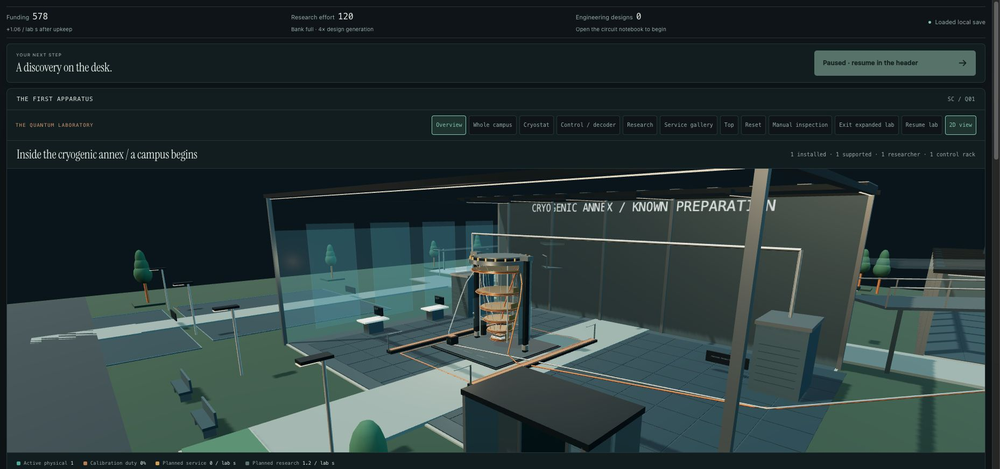

# Full research history and laboratory controls

Branch: `feature/research-history-2015-2026`. Private local development, 5 October 2026. The source checkpoint is `1ebba66`; final browser fixes and accepted reviews follow in a separate local commit. This checkpoint was local. The user subsequently authorized the GitHub upload on 5 October 2026; later campus/UI work and actual completion have separately recorded evidence.

## Implemented scope

The default archive retains all **44 discoveries**, including all 33 earlier foundations, in a full **1982–2026** timeline. Every year from 2015 through 2026 appears. The bibliography has **51 academic sources**, with eight verified additions, accessible before purchase. Source dates, publication landmarks and game prerequisites are explicitly separate. The bibliography is curated, not an exhaustive history of quantum computing.

The eleven new 2015–2025 discoveries require fresh paid studies, then separate research purchases. All eleven are mandatory before the gift ending in new games. Their controls teach preparation versus precision, mitigation overhead, maintenance/service opportunity cost, memory versus feedback, distance versus footprint, streaming versus latency, and factory supply versus application width. The 2018 study intentionally accepts a precisely measured poor preparation without qualifying ground energy. The 2022 study records the actual stricter feedback comparison and requires no irreversible hardware downgrade. The 2025 study is a partial lane/footprint check, not a full workload result. See [design](RESEARCH-HISTORY-DESIGN.md), [model](MODEL.md) and [bibliography](PAPERS.md).

Earlier completed gifts remain earned. Explicit idle opt-in, after Continue where necessary, adds the programme without inferred receipts or replacement of the first milestone. Invalid partial or forged receipt blocks are rejected. Final discovery and Audit purchases preserve paid jobs. Entry costs remain spent on cancellation or failure; studies do not create repeatable grant income.

## Engine and legal completion

The lead ran the integrated suite: **82 passed, zero failed, zero skipped**. The engine builder and independent AI reviewers separately exercised the relevant scope. Nine new intent tests cover mandatory fresh purchases, cancellation/failure, one-time payments, captured VQE settings, recomputed imports, irreversible-upgrade recovery, old completed gifts, paid-job preservation and the existing planning-credit ceiling. Legal complete routes assert **44/44 discoveries and eleven accepted study receipts**, including alternate logical/workload strategies. These are accelerated public-action engine simulations, not ordinary browser play.

Six paired campus policy runs, three seeds per policy, are saved in [pacing-matrix.json](evidence/research-history/pacing-matrix.json). Their hashes identify the actual pre-final-availability candidate and must not be relabeled to the final source. The subsequent Audit-availability correction changes routing, not costs or physics. An independent reviewer replayed both policies at seed 424242 against the accepted final engine, including 16 strict save round trips per route.

| Policy | Previous comparable route | With eleven studies | Increase |
| --- | ---: | ---: | ---: |
| Local/frontier | 85:32 | 91:30–92:06 | 5:58–6:34 |
| Bulk/infrastructure | 75:18 | 83:54 | 8:36 |

These two campus policies earn 41 discoveries, all eleven annual purchases, six objectives and six precision requests; three optional toy discoveries are omitted. Separate legal all-discovery tests cover 44/44. Annual research purchases cost 15,950 funding, 28,800 effort and 4,090 designs. In these policies entry fees total 777 funding, with 148 apparatus seconds translating to 220–221 laboratory seconds. Longest tracked discrete-action gaps are 397 and 205 seconds; configure calls are omitted, so these are not unavoidable waiting times or observed human inactivity. Additional duration alone does not establish deeper enjoyment or optimal balance.

## Native interface review and resolved bugs

The independent AI gameplay reviewer used isolated native Chromium and strictly parsed fixtures earned through public engine actions. Fixtures never entered the user's Chrome save. The native matrix verifies the full timeline/original discovery identifiers, annual year coverage, 51-paper collection, 1440/375/320 layouts, narrow keyboard navigation, quote stability, actual paid 2018 study and purchase, live feedback/reload, truthful 2022 feedback comparison, and legacy ending/idle opt-in preservation. [Gameplay review](RESEARCH-HISTORY-GAMEPLAY-REVIEW.md) records its actual source scopes and observations.

Resolved findings:

- Completed VQE study fees previously followed future shot/mitigation controls. They now use the captured receipt and say **Recorded entry**; new entries remain current quotes.
- Unavailable future studies could navigate to hidden controls. Their Adjust button now follows actual availability.
- New study feedback previously lost the existing live result channel. Study results now retain that channel through automatic renders, load and import; deliberate actions retain the existing clearing behavior. The archive also displays the last study outcome.
- Maintenance study navigation previously attempted to focus a disabled calibration slider under automatic calibration. It now selects the existing allocation section's first enabled control.

The independent AI quantum reviewer verified the added sources, model boundaries, strict receipt contracts and scientific result copy. The final source review resolved the 2022 irreversible-decoder trap and the distinction between a successful bad-preparation study and failed ground qualification. [Science review](RESEARCH-HISTORY-SCIENCE-REVIEW.md) preserves initial proposals and the later superseding acceptance; it does not claim a credentialed human review or reproduction of any paper.

## Mouse zoom, toolbar and continuous cables

Desktop camera controls keep **2D view on the same row**. Narrow desktop toolbars scroll internally; touch layouts retain their compact controls. Native mouse-wheel input uses the bundled OrbitControls, with per-camera distance limits and preserved manual framing. Focused +/− keys provide keyboard zoom, ignore modified shortcuts and respect modal/2D visibility. Re-selecting a station restores its authored framing; Reset restores Overview. Pointer changes update the fine-pointer zoom policy, preserving vertical page scrolling on touch.

The 3D reviewer verified trusted native wheel input, whole-campus and close camera limits, exact preset restoration, resize/growth preservation, keyboard/focus/modal/2D guards, desktop toolbar alignment, cold 375/320 touch layouts, and live fine/coarse pointer changes. Trusted touch swipes scroll the page without zoom. No page overflow or application errors were observed. These isolated observations are not measured physical-phone frame rates. See [3D review](RESEARCH-HISTORY-3D-REVIEW.md).

The user's apparently severed cable was a real geometry defect: default spline interpolation dipped below the floor (silver minimum −0.5055, copper −0.4023). Only the two floor-spanning routes now use zero-tension interpolation, preserving endpoints and pulse paths while keeping their minimum centre heights at 0.34 and 0.30. The actual rendered tube minima are 0.2992 and 0.2540, above the 0.20 floor/path surface. Replay paths retain their earlier interpolation. Independent numerical and native Cryostat/Control/Top/Overview checks confirm visible continuity. The lead also ran the saved [clearance audit](analysis-tools/research-history/campus-cable-clearance-qa.cjs). Ordinary Chrome on a separate local QA origin confirms the repaired expanded Overview, retained foundations and mouse-wheel inspection behavior. The user game/save was not imported or edited for these checks.

## Reproducibility and remaining acceptance

Final engine SHA256: `85da1ac8d7dff065fee62f4d40a979472ed9f8d60c618be79548fc759a765e83`.
Content SHA256: `f158bfec87b44590ff3c901da2c893334accc670b83a4f5dd06be313886bc6b2`.
App SHA256: `ba68a7f5f88671f7cf83840907903af72e972a70d612504ce7e0b888a3cb0b41`.
Renderer SHA256: `87ff707b1088b6fb5f3ef3d8d2440f5492b0490f13c4efcd04b3a7407aba9835`.
3D stylesheet SHA256: `47ce98e9b46b4323924bee4940383eaedc67bbf93f2599bc565970ae94cee20e`.

The earlier broad native matrices retain their own hashes; the maintenance-focus and pointer/cable corrections receive focused final-source rechecks. JavaScript syntax, regenerated 3D entry/bundle reproducibility and Git whitespace checks pass. All 50 contrast pairs pass, minimum 4.58. No raw generated/imported save is committed as player evidence.

**The fresh full ordinary-Chrome campaign is now complete at 93:05:** all 44 discoveries, all eleven annual fresh study receipts and purchases, all four workloads, six finite objectives and six precision requests. [The actual playtest report](RESEARCH-HISTORY-CHROME-PLAYTEST.md) records ordinary controls, earned resources, milestones, source scope, save/reload and continued-play checks. No save imports, injected resources, internal engine actions or accelerated time were used. The 78:19/33-discovery record remains historical. The AI player knew the implementation; blind human enjoyment and physical-device performance remain unverified.

The new operations/warehouse and interaction work is separately accepted in [the campus review](CAMPUS-OPERATIONS-LOGISTICS-VISUAL-REVIEW.md). Its hashes do not replace this programme checkpoint's hashes. Later ready-hint punctuation and recorded-ending navigation fixes are covered by the actual playtest's bounded rechecks.
