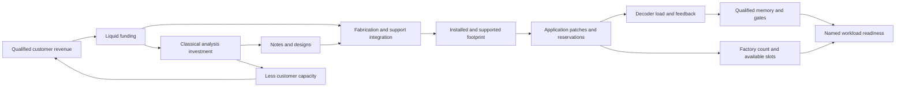

# Singular Value gameplay review for Coherent’s 3D laboratory

**Independent AI gameplay/economy review · 5 October 2026 · implementation recommendations, not implemented features**

Coherent already reproduces several of Keir’s strongest economic decisions. Its main remaining weakness is that those decisions usually finance a sequence of one-time unlocks. Singular Value maintains several evolving frontiers at once: model size, trained data, capability, agents, research, liquidity, and physical infrastructure. Improving Coherent should make its experiments and laboratory choices interact repeatedly, then let the 3D facility show those consequences. Adding more prices, counters, or waiting alone will not achieve this.

The first recommended release is a visible causal control layer over the existing engine. The next is a small recurring experiment/contract frontier using the existing two-spin model. A treasury should follow only if it creates a distinct financing decision. Literal Bitcoin is an optional tribute, not a prerequisite for good gameplay.

## 1. Evidence, scope, and limits

The live page at [Singular Value](https://singularvalue.org/) was downloaded read-only on 5 October 2026. Its SHA-256 exactly matches our preserved `original-game.html`: `a386c26313cb73a77ef8d03cd9cfcea363ac85355099e83af422841dad93b796`. The web reader could not open the site; the successful direct HTTPS download supplied the verification. The file is 107,392 bytes and has 1,400 lines. No changes were made to it.

This review reads both original inline scripts, the project inventory, original audits, and current `game.js`, `content.js`, `app.js`, and `instrument-3d.js`. It also reads `ANALYSIS.md`, `CAMPAIGN-DEPTH.md`, `DEPTH-VERIFICATION.md`, `QUANTUM-DESIGN.md`, `PAPERS.md`, and the immersive-laboratory design and verification documents. It adds a comparison of causal interactions and implementation priorities; the full original inventory remains in [original-project-inventory.md](original-project-inventory.md).

The 13 existing original-engine assertions were rerun read-only in a Node VM, stopping the audit before its output-file writes. All 13 passed. Additional arithmetic probes ran against the exported original and Coherent engines in scratch Node processes. Their scenarios are explicitly constructed metric probes, not earned campaigns, browser play, or evidence of human enjoyment. The reviewed baseline is local commit `7c9e168905e521524076a25a31905c536607d93d`; the parent may subsequently change independently reviewed bugs. Coherent engine SHA-256 for these probes: `8c82dbef4b72c2d38e565b5ab12344538b1096a075e09a3e760d21d158e84847`.

The parent agent is separately playing the served 3D game through ordinary Chrome controls. At the document-consensus checkpoint, that legal playthrough was paused at **18:21 laboratory time** and had not finished. This review did not inspect or alter that session, inject resources/time, import saves into it, or change served project files. Native observations reported by the parent are identified below. Existing strategy timings are attributed to their saved audits, not to that active playthrough.

This is an independent **AI** specialist review. It is not a credentialed human assessment, a new quantum scientific consensus, a finished redesign, or proof of fun. The recommendations that change the scientific model need independent quantum review before implementation. Proposed numeric pacing targets are design targets, not findings from academic papers.

## 2. What Keir’s game actually combines

The snapshot contains 84 advances, 16 action functions, 89 initial state fields, three binary research forks, ten identity levels, and seven visual eras. Coherent has 30 academic discoveries, 14 classical engineering advances, ten experiment recipes, four workload recipes, and 45 initial state fields. These counts describe different categories; they cannot be summed into a meaningful complexity score.

More useful is the inventory of player decisions and their changing consequences:

| Original decision | Exact code anchors | Benefit | Competing consequence or next bottleneck | Coherent equivalent and gap |
| --- | --- | --- | --- | --- |
| Grow width or depth | `D.N`, `depthEff`, `maxN`, `widthFor`; `ACT.neuron/layer/prune` · original lines 402–420, 763–766 | More parameters improve the loss term, grants, credibility | Memory limits growth; larger active models train and serve more slowly; adding a layer can shrink width at full memory | Installed/support minimum is sound, but physical count is mostly a qualification footprint and purchase ladder |
| Stop growth or prune | `autoGrowOn`, `growOn`; tick 870–877 | Recover training/serving throughput or avoid oversizing | Lower size-based capability; automatic growth never shrinks an already oversized model | Reversible allocation exists, but no continuing scientific frontier makes narrowing a task repeatedly attractive |
| Hire grads/labs versus buy hardware/data | `COST`, `gradRate/labRate/crawlRate` · 453–479 | Different paths improve growth, throughput, or data supply | Each investment solves only its corresponding constraint | Staff, racks, pulses, decoders, automation and workshops already supply distinct investments; show their marginal effects together |
| Researcher versus notebook | `credFree`, `insightCap`, `insightRate` · 421–425, 795–796 | Rate versus storage | Staff are irreversible; a future idea can exceed the chosen storage | Coherent correctly improves this with reversible trust assignments and no silent effort loss |
| Spend insight versus retain a full store | `D.ideaRate`; tick 863–868 | Buy an unlock now | Full insight produces four times the base researcher idea rate; agent idea work is a separate additive stream | Coherent’s fourfold design bonus is a faithful strategic adaptation; preview the lost bonus and refill time |
| Learning rate | `lrOpt/lrGain/hazard`; tick 884–894 | Train faster | Optimum changes with model size; failures lose tokens and interrupt service | Calibration drift is the nearest existing counterpart, but earned auto-calibration largely settles it |
| Training versus serving | `trainFrac`, `tokRate`, `capacity` · 426–429 | Improve future capability or current cash | Increasing one takes compute from the other | Science/service duty exists, but ordinary staff research runs independently and most quantum evidence is a one-time gate |
| Price per request | `fairPrice`, `demand`, `served`, `bestPrice` · 431–452 | More margin per delivered unit | Excess price leaves capacity idle; underpricing wastes margin; available capacity changes with agents and model size | Current contract pricing correctly uses delivered work and elastic demand; the single Bell-service class makes it settle quickly |
| Press releases | `hype`, `bubbleRatio`; tick 897–907 | More grants/demand | Unsupported expectations trigger a winter and staff losses | No direct counterpart. Avoid copying hype penalties until measurable results and recoverable consequences are visible |
| Open versus closed weights | projects `open/closed` · 565–568 | Openness buys reach/credibility; closure buys margin | Excludes the alternative; effect depends on later spare capacity | Current open/proprietary branch already has proven policy-dependent consequences; retain it |
| Pause versus race | projects 593–596 | Lower future pressure or cheaper datacenters | Different speed/pressure costs | Current verified/rapid commissioning is a reasonable architectural adaptation; its operational consequences need stronger presentation |
| Monitored versus latent agents | projects 625–628 | Lower pressure or more agent work | Effectiveness competes with danger | Do not import consciousness claims. A later audited-versus-aggressive operating policy could instead expose declared reliability margins |
| Agents before paying customers | `running`, `served`, `agentWork`; tick 858–881, 917–919 | Research, ideas, experience, synthetic data, recursive efficiency after their unlocks | Consume serving capacity first; owned agents may be idle | Analysis stations already consume customer capacity first, but do not open a continuing task frontier |
| Bitcoin versus liquid dollars | `btcPriceAt`, `ACT.buyBtc/sellBtc`, treasury tick · 481–482, 776–793, 928–940 | A second capital stock and later robot payments | Spending reserves delays equipment/research; sales and purchases move the quote; a later event penalizes unprotected holdings | Coherent has funding/design stocks and no treasury. A new financing system needs a use beyond appreciating wealth |
| Robots, fabs and solar split | `fabRate`, `solarRate`, `poweredFab`, `gpuEq` · 404–410, 460–462, 921–926 | Build a physical compute loop | Manufactured hardware can lack power; power alone does not manufacture hardware | Fabrication versus support integration captures the minimum constraint, but both are directly funded throughput without financing/procurement choices |
| Dampening | `F`, `pressure`, `netPressure` · 410, 458–459 | Avoid narrative failure | Diverts compute; choices change pressure growth | Keep Coherent’s reliability/task budgets, not a consciousness bar. The original’s exact 40% neutral setting limits lasting strategic tension |

Five original continuous sliders govern learning rate, compute split, price, robot fabs/solar split, and dampening. Growth checkboxes add stopping/automation choices. Coherent already exposes code distance, factories, calibration, service duty, price, analysis share, fabrication share, angle, shots, mitigation, and earned automatic pricing/calibration. Its problem is therefore not simply “too few sliders.” It is that many settings become safe presets while the next paper waits for accumulated currency.

## 3. Causal loops worth adapting

### A. A larger number can make the system worse temporarily

Singular Value’s `N = floor(width)² × (layers−1) + floor(width)` influences memory, loss, grants, credibility, training cost, and inference cost. Its mixture-of-experts upgrade separately changes active parameters to `N/8`, preserving memory/size effects. This separation makes efficiency research transformative.

A constructed fixed-compute probe with width 1,000, four layers, ten GPUs, ten million trained tokens, half compute on training, and each model’s optimal learning rate gives:

| Change | Parameters | Capability | Training tokens/s | Serving capacity/s |
| --- | ---: | ---: | ---: | ---: |
| Base | 3,001,000 | 12.05 | 1,388,565 | 4,166 |
| Width 1,414, same hardware/data | 5,999,602 | 13.30 | 694,560 | 2,084 |
| Base with eight-way active-parameter routing | 3,001,000 | 12.05 | 11,108,519 | 33,326 |

These are exact game-formula calculations, not real model benchmarks. Doubling model size buys about 10% more capability here while halving throughput. A meaningful Coherent analogue is **task difficulty/precision versus qualified delivered throughput**, not qubit count versus a universal capability multiplier.

The original loss form and simplified training-size rule draw on [Hoffmann et al., 2022](https://arxiv.org/abs/2203.15556). Its capability conversion, depth modifier and gameplay constants are additional abstractions.

### B. Internal automation must have a visible opportunity cost

Original running agents are capped by serving capacity. Customer capacity is what remains after those agents. At a fixed price, saturating capacity with agents reduces customer revenue to zero. The investment may still pay through research/experience; the player must decide when.

Coherent’s `sharedCapacity = lanes × 1.5 × effectiveServiceDuty` and `automationRunning = min(owned × analysisShare, sharedCapacity)` already create this decision. In a constructed scenario with six staff, four analysis stations, a full notes bank, 90% service and 20% calibration:

| Analysis duty | Stations running | Customer capacity | Designs/lab s | Net funding/lab s |
| --- | ---: | ---: | ---: | ---: |
| 100% | 4 | 3.56 | 7.72 | 31.95 |
| 50% | 2 | 5.56 | 4.72 | 36.39 |
| 0% | 0 | 7.56 | 1.72 | 39.85 |

The model uses matched automatic pricing and qualified known-preparation service. It is a metric sensitivity example with constructed unlock flags, not a legal campaign fixture. It establishes a real tradeoff already present in our code. The player should see this table’s practical equivalent while dragging the slider, instead of having to infer it from separated counters.

### C. Spending can reduce a second resource’s production

At 50% analysis in that probe, emptying the notes bank changes designs from 4.72 to 1.18/lab s. Merely adding a notebook changes capacity from 1,920 to 2,400 and also removes the full-bank bonus until refilled. This is one of the best surviving original-inspired interactions.

A purchase preview should say how much effort remains, whether the fourfold bonus is lost, how long refilling takes under current duty, and whether the upgrade itself improves refill/design output. A storage upgrade should explain that it permits the next discovery while temporarily delaying design production. Do not add a separate “creativity” meter: the existing interaction is sufficient.

### D. Physical expansion is constrained by its companion system

Keir’s fab-built GPUs only contribute through `min(fabGpus, solar × 1000)`; store-bought GPU/datacenter capacity is outside that solar constraint. His robot split affects future rates of fabs and solar, so the shortage can move after an investment. Neither output alone guarantees useful compute.

Coherent uses `active = min(installed, supported)` and explicit fabrication/integration rates. Code distance then changes patch footprint; reservations consume application slots; total patches determine decoder-stream load. More hardware can therefore expose a new decoder shortage. Factories use footprint while reducing fresh-state wait. These are strong combined parameters, but the 3D lab currently represents them mostly as equipment counts and schematics. Make constrained/idle equipment visually explicit and explain the minimum at the relevant station.

This is a diagram of existing Coherent dependencies, not a proposed new quantum speedup loop.

## 4. Bitcoin: its role, exact behavior, and what to borrow

The treasury is more than another income counter because it joins two otherwise separate stages. Early grants/API revenue can be converted into coins; later robots require coins. The conversion changes available cash, future purchasing power, and the path into physical infrastructure.

The complete relevant implementation is `original-game.html:370–371, 390–391, 475–482, 547–548, 575–576, 619–620, 648–650, 775–793, 928–940`.

| Treasury component | Verified source behavior | Strategic implication | Adaptation judgment |
| --- | --- | --- | --- |
| Supply | Holdings cap at 21 million; no mining action or issuance schedule | Another hard cap beside data, memory and world demand | A finite fictional procurement inventory may be more useful than a literal global supply |
| Buy | Spend half of liquid funds; 20 slices; recalculate price as holdings rise; refund unspendable funds | Convert enough reserves too early and research/hardware wait | Show the liquid reserve after conversion and its next purchase coverage |
| Sell | Sell half of holdings in 20 slices; quote falls as holdings are removed | Treasury value and liquidation proceeds differ | Preview executable proceeds; do not use marked value as guaranteed cash |
| Price | `trend × exp(noise) × (1 + 3 × holdingShare²)` | Concentration raises the quote nonlinearly | The holdings-based price is a fictional self-impact model, not an external market |
| Trend | Starts at $0.01; drift 0.0036; logistic growth in log price toward a $10 million trend limit | Long holding is structurally favored | Copying guaranteed appreciation would produce an obvious dominant investment |
| Noise | Mean-reverting log noise: decay coefficient .01 and Gaussian amplitude .06 | Short-term uncertainty remains despite favorable long-run trend | If used, events and risks should be inspectable; avoid random catastrophic stalls |
| Smart-contract advance | Multiplies treasury drift by 1.2 | Research changes treasury performance | A finance bonus is a game rule, not a demonstrated quantum result |
| Robot acquisition | BTC cost is `1e9 × 1.2^robotBuys / currentQuote`; units are `floor(100 × 1.06^robotBuys)` | The cash-equivalent batch cost rises faster than batch size; accumulating coins can fund expansion | Transparent bulk procurement/lead-time alternatives could reproduce this decision without Bitcoin |
| Quantum event | First treasury tick in era ≥5 loses 90% of holdings unless `pq`; no resource-budgeted attack | Early insurance research matters later | A dated fictional protocol event; do not import it as evidence about real Bitcoin security |

A constructed $100-trend, $1-billion-cash probe spends $500 million and acquires 4,771,444.62 coins. The holdings-based quote rises to $115.49 and marked coin value becomes $551.04 million. Selling half produces $259.44 million of cash; the remaining quote falls to $103.87. The apparent marked gain cannot all be liquidated at the displayed quote. No price ticks occurred during this calculation.

The implementation’s finite slice approximation also has a small accounting artifact: an immediate buy followed by enough half-sales to reduce holdings nearly to zero yields approximately $1,000,989,743.90 from $1 billion, with fixed trend/noise. This is a scratch source probe, not a recommendation or a normal-player test. If adapting any market, an immediate round trip must conserve wealth before fees, or lose the disclosed fee; discretization and self-impact must not create free money. Do not import this artifact.

The original treasury is intentionally favorable fiction: no external order book, fees, bankruptcy, persistent bear market, or mined-coin competition. Its pricing model should not be understood as investment guidance. The strategic structure to retain is **liquidity now versus committed capital that unlocks a later production system**.

### Recommended finance option

First prototype **procurement commitments**: retain liquid funding or reserve it for a discounted chip/support delivery after a visible lead time. Use two supplier offers with distinct funding/design cost, quantity, delivery date, and qualification/commissioning requirements. An undelivered shipment supplies no active qubits or decoder capacity. A refundable reservation should disclose its fee. This connects cash flow to construction decisions using the existing currencies and facility.

A literal Bitcoin tribute could later be a clearly fictional optional treasury with the same reserve/procurement use, visible price history, fees and conversion preview. It should neither be mandatory for finishing nor generate research or quantum capability merely by rising in price. Do not add both financial systems to the first implementation.

### Cryptography boundaries

Bitcoin transaction signatures and elliptic-curve discrete logarithms are distinct from RSA factorization; the game’s toy factor certificate cannot imply the ability to empty wallets. The [Bitcoin transaction documentation](https://developer.bitcoin.org/devguide/transactions.html) explains transaction signatures; [Roetteler et al., 2017](https://arxiv.org/abs/1706.06752) provides logical-circuit resource estimates for elliptic-curve discrete logarithms under specified assumptions. These are not complete physical-machine attack budgets or a deployment timeline.

A toy security exhibit must use synthetic keys owned by the tutorial, count the named algorithm’s resources, and identify classical verification. Existing ledger outputs cannot be declared migrated merely because a paper is purchased. [Regev’s manuscript](https://cims.nyu.edu/~regev/papers/qcrypto.pdf) concerns hardness relationships and assumptions, not a guarantee that every lattice scheme is quantum-proof. The [Bitcoin white paper](https://bitcoin.org/bitcoin.pdf) can be an accessible historical reference; it does not validate the original game’s market dynamics.

## 5. Where Coherent’s current combination depth stops

These are verified code behaviors. Whether they feel tedious or satisfying is a playtest question.

1. **Historical qualifications dominate.** `qualificationNow` preserves the existing signal/Ramsey/echo/readout/benchmark/circuit/VQE evidence once recorded. It rechecks current readiness for memory, gates and factory. Most early measurements are therefore a single prerequisite rather than a continuing experimental frontier. `qualify` awards reputation/funding once per experiment ID. Repetition otherwise mainly refreshes a result.
2. **Service has one workload class.** Qualified batches of known Bell preparations, elastic demand and shared capacity are honest and coupled. They do not ask the player to select among breadth, depth, precision, delay, or different admissible recipes.
3. **Shots change cost but not recipe duration.** VQE uses 1,024/4,096/16,384/65,536 shots per Pauli group. Mitigation multiplies modeled acquisitions by four and increases entry cost, while `startExperiment` still uses the same ten-apparatus-second recipe duration. Service/calibration duty can slow completion, but increasing acquisitions itself does not. The current tradeoff is precision versus funding, not precision versus throughput. Keep this distinction explicit in any redesign.
4. **Current modeled values and recorded measurements need clearer separation.** The chapter-one RB readout displays `metrics.rbError` as pulses/drift change; the original job result remains recorded text. The selected coherence traces are fixed scenarios, not fitted measurements. A new experimental frontier needs explicit recorded estimates and current predictions rather than silently turning simulated parameters into observed data.
5. **Final workloads are fixed recipes.** `workloadStatus` correctly checks memory, gates, states, preparation, repetitions, time and footprint. Players choose hardware, distance and factory allocation, but cannot select a task-specific alternative recipe. This is a strong basis for a later space/time decision.
6. **Optional branches are poor investments for a fast ending.** The Factoring discovery costs **5,100 funding and 900 designs**; the Grover discovery separately costs **5,100 funding and 1,100 designs**. Together they cost 10,200 funding and 2,000 designs before their effort costs and experiment fees. They unlock 600/700 payout tutorials with entry fees. Chemistry consumes another discovery investment. They are optional reading/workload routes, not accelerators of the main audit route. Skipping them is rational under the user’s fastest-completion objective.
7. **A 27/30 ending cannot become a 30/30 postgame.** `checkEnding` sets `ended`; tick stops, purchase readiness becomes false, and settings/actions largely lock. The parent’s previous 27/30 result really leaves three discoveries unavailable for later collection. This is a design choice; change it explicitly rather than describing the remaining discoveries as collectable after completion.
8. **Automation mostly stabilizes settings.** Price matching and calibration remove chores. Staff/automation still fund the same ascending card sequence; acquiring them does not unveil a new task-solving loop comparable to agent experience or synthetic data.
9. **The large 3D facility is primarily an inspection interface.** Equipment reacts to purchases, activity and allocations; station buttons change cameras. It does not yet make apparatus locations meaningful places to choose jobs or see local bottlenecks. A second copy of the engine inside Three.js would be a mistake; expose existing native controls contextually.
10. **Known waiting is substantial.** The existing matrix records 149–163 seconds of explicit experiment jobs and a maximum reference action gap of 7:25. This is roughly 3–4% explicit-job occupancy over the documented 69–82-minute campaigns. Customer batches continue during parts of these waits, but their progress supplies money rather than a new visible scientific answer.

Current economic depth is real: [DEPTH-VERIFICATION.md](DEPTH-VERIFICATION.md) records 20 legal runs finishing in 69–82 minutes, a fastest matched comparison of 62:10, and reversible recovery from a four-hour full-analysis stall. Open dissemination wins a matched two-station plan; proprietary wins a four-station plan. More targeted automation is not uniformly faster. These results contradict a blanket claim that our engine has no strategy. They also do not establish enjoyment or the provisional 90-minute first-human-play target.

Keir’s prior automated audit took 3:37:14; the user reports 1:33. Neither timing is an optimality proof. A fair comparison needs matched player knowledge, normal controls, pauses, and actual wall-clock/visible-lab timing. Longer automated duration is not an improvement objective by itself.

## 6. Ranked redesign recommendations

### Priority 0 — Make existing choices legible and satisfying

**Implement first.** It offers the highest value with the smallest model change.

- Add a compact station panel showing the controlling constraint and the next eligible action. Cryostat: calibration versus productive duty. Research: refill time and notes/design opportunity cost. Control: customer versus analysis slots. Processor: installed/support minimum. Memory: distance/slots/error/decoder. Planning: factory wait versus application footprint. Fabrication: commissioned outputs and their funding limit.
- Reuse the original native buttons and IDs, or dispatch their existing engine actions through one shared UI path. Keep keyboard/touch operation and 2D access. Three.js owns presentation, not game rules.
- Preview immediate purchase/duty consequences with the engine’s own metrics: before/after useful slots, customer delivery, net funding, design rate, qualification and current target readiness. Distinguish snapshot deltas from a funding-only payback estimate; pulse quality and drift can change future outcomes.
- Make unused/held capacity clear: an owned analysis station can be idle; an unsupported chip adds no active footprint; a quality-held service earns zero; a reserved protected schedule pauses customers and construction. Use static colors/labels for reduced motion and a short purposeful transition for changed flow.
- Preserve player camera choice during routine inputs. An explicit Follow action should clearly state and satisfy its behavior. **Confirmed native bug, with fix verification pending at this checkpoint:** the parent’s legal Chrome run selected a manual station, explicitly re-enabled Follow, and started a new experiment; the enabled control did not follow because `followExperiment` required the Overview camera. An independent AI 3D specialist agreed with the causal finding and the narrow presentation fix. The parent removed that Overview guard and clears `followJob` on explicit enable so the current/new workflow can be followed. This changes no engine rule, resource, laboratory time or save. The source patch was applied while paused; native retest remains required before calling the fix verified.
- Show the next two discoveries’ storage requirements so future reassignment is deliberate. Forecast waiting with the full-bank transition included, rather than dividing a design deficit by today’s rate throughout the entire wait.

Acceptance: a new player can name the limiting resource and predict the direction of the next slider/purchase effect from the station panel. Browser tests demonstrate manual, keyboard and narrow-screen controls; paused previews change no save. Positive and negative marginal cases must both be shown. No new scientific claims are needed.

### Priority 1 — Make experiments recur as a meaningful frontier

**The next substantive gameplay release.** Start with the already classically computed two-spin Hamiltonian and its existing measurement groups; avoid adding another hardware architecture or a fictional quantum-training score.

Offer a short series of declared tutorial objectives: an initial coarse estimate, a tighter bound, and a second angle/observable check with the same explicit model. At each objective, the player chooses angle, shot budget, mitigation and apparatus/service allocation. More acquisitions cost both funding and a declared laboratory-pacing budget. Statistical precision, residual bias and ansatz error stay separate. An inaccessible precision request explains whether more shots can help or whether the bias/ansatz must change.

Keep repeat benefits bounded and objective-based: each new verified tutorial objective may unlock a small classical workflow improvement, a contract type, or one earned trust assignment. Repeating an already satisfied easy objective must not farm unlimited reputation or currency. Failure keeps measurements and explains the violated component. Do not make clicking the same successful experiment mandatory dozens of times.

Scientific basis: [Peruzzo et al., 2014](https://arxiv.org/abs/1304.3061) supports the hybrid measurement/optimization concept, with photonic rather than superconducting hardware; [Takagi et al., 2022](https://arxiv.org/abs/2109.04457) supports the importance and limits of mitigation sampling overhead. Neither supports our reward amounts or timing. The original toy Hamiltonian remains an explicit classical simulation.

3D payoff: show the three actual measurement groups and a separate bias budget at the experiment station; the job occupies the control station and displaces service. If samples are generated incrementally, those counts belong to the engine and must survive save/load; otherwise reveal the completed sampled result rather than fabricating convergence animation. One short breakthrough opens a new meaningful objective, not merely another costlier card.

The first tutorial objective series is an implementation pilot, not sufficient depth for a whole campaign. If it is satisfying, carry the frontier forward with a finite family of named tasks: new physical-control evidence after commissioning, distinct known-preparation contracts, and progressively stricter logical resource scenarios. Each family needs an inspectable success criterion and a new combination decision. Reusing one tiny tutorial unchanged across all six chapters would simply move the repetition elsewhere.

Acceptance: two legal strategies differ in total acquisitions, funding and completion time; a high-shot/biased trial demonstrably cannot pass a bound below its residual-bias floor; an incorrect angle cannot be repaired by sampling alone; ordinary UI play records a new useful objective or tradeoff during previously long waits. Quantum review must accept the actual implementation and labels.

### Priority 2 — Give service contracts different demands

Start with **two** classes rather than a simulated marketplace full of organizations. One class rewards high-throughput known preparations with a loose declared tolerance; another requires a more expensive reproducible tutorial estimate. Keep task-specific qualification, acquisition counts, duty, delivered units and payout distinct. Quotes/deadlines/reputation are disclosed game management assumptions.

Do not count a classical analysis slot as a quantum batch or allow an atomic logical schedule to run simultaneous incompatible customer preparations. More qubits only help when the chosen lane/workload model can use them and qualify. Classical alternatives should remain inspectable where relevant.

A player chooses which contracts to admit and what apparatus time to commit, with finite visible queued work. Initially use ordinary explicit jobs and queueing rather than general scheduling frameworks or an auction simulation. Earned dispatch automation can later remove routine admissions and preserve the selected policy.

3D payoff: visible customer cards arrive at the service station, run through declared preparation/readout steps, and leave as paid results; quality-held or displaced work remains labeled in a finite queue. No endless decorative traffic detached from delivered units.

Acceptance: a capacity-focused and a precision-focused plan each outperform the other on at least one declared contract mix; no permanent fork dominates every tested mix; queued commitments cannot silently exceed apparatus time; an unqualified or undelivered contract pays nothing. Save/load and hidden-time policies remain truthful.

### Priority 3 — Turn logical allocation into task-specific recipe choice

Keep the existing surface-code campaign. Add one alternative **for a named task**, such as a compact recipe versus a faster recipe with different width, depth, magic-state demand and conservative precision/error accounting. The player selects a recipe, distance, factories and decoder investment. A larger factory allocation lowers supply time only when fresh states are limiting, while reducing application footprint.

The existing `parallel = max(gateTime, factoryTime, feedbackTime)` and waiting-memory term provide a simple basis. Do not make extra factories universally multiply speed. Add explicit used/idle logical-patch allocation only if it solves a demonstrated decoder/space decision; all currently counted patches contribute syndrome load, so the change requires fresh scientific accounting and tests.

[Litinski, 2019](https://arxiv.org/abs/1808.02892) supplies architectural space/time tradeoff inspiration. Its tile budgets must remain separate from Coherent’s exact standalone `2d²−1` patch counts. Recipes need declared assumptions and review; do not manufacture a citation for chosen gate numbers.

3D payoff: the allocation table reshapes, idle/routing/factory/application units remain readable, and the bottleneck lane changes before the job starts. Show one-execution modeled microseconds and repetitions separately from laboratory pacing seconds.

Acceptance: a compact route and a faster/larger route both qualify and finish legally; increased distance trades error against footprint/time; extra factories cease helping once another lane limits runtime; all risk terms, preparations, readout, classical processing, repetitions and wait exposure are counted once.

### Priority 4 — Add financing only after the core frontier works

Implement the procurement option from section 4 if playtests find a meaningful cash-flow decision missing. Do not add a cryptocurrency counter simply because Singular Value has one. The financing state must interact with delivery/commissioning and leave players a recoverable liquid-reserve path.

3D payoff: a reserved expansion bay gains delivered, uncommissioned equipment crates; installation follows actual funded completion; supported and installed cohorts remain distinct. Labels use schematic units, not a purported real qubits-per-fridge law.

Acceptance: buying immediately, reserving delivery and saving cash each win under at least one disclosed scenario; supply and accounting remain conserved; no immediate conversion round trip creates money; arrivals do not count as qualified hardware; unlucky events do not force reset. Literal Bitcoin remains an optional later tribute decision.

### Priority 5 — Give optional discoveries a purpose and a deliberate epilogue

Allow a player to choose main completion or fuller collection explicitly. After the private gift ending, a **Continue laboratory** epilogue could preserve the completed ending record while reopening optional activities. This requires a deliberate engine/save-state design; flipping `ended` from the renderer is unacceptable.

Before the ending, one optional tutorial could unlock a modest classical scheduling/procurement benefit. Tie that benefit to its demonstrated tutorial objective, not to claims that factoring 15 or searching eight entries establishes useful quantum advantage. Keep a fastest main route possible without the detour.

Acceptance: 27/30 main ending remains legitimate; a legal continuation can reach 30/30 without resetting or losing the gift; rewards cannot repeat; both main/epilogue saves round-trip; the UI clearly distinguishes historical completion from continuing activity. A detour should produce a measurable benefit in some policy, rather than a completionist tax disguised as strategy.

## 7. Make progression change the kind of interaction

The original’s eras, identity ladder, automation unlocks, unfamiliar late discoveries and two contrasting endings change the player’s sense of what they control. This is a separate source of engagement from having a long upgrade inventory. Its 48 short executive-news items add character to the middle game; their cadence does not establish that waiting is fun. The late narrative includes intentional fiction, so copy its escalation and wit rather than its unsupported scientific claims.

Coherent’s existing laboratory gives us a better physical canvas. Use chapter transitions to introduce a new working surface and retire a familiar chore:

| Campaign moment | New player interaction | Purposeful 3D transformation | Chore to retire |
| --- | --- | --- | --- |
| First signal → Control room | Prepare, inspect uncertainty, tune maintenance | The cryostat’s known preparation/control/readout path becomes legible; the control station gains the measurement notebook | Repeated opening preparation |
| Noisy circuits | Optimize a named observable and choose qualified customer work | Processor island and actual measurement groups gain an active work queue | Manual admission of easy, already-qualified batches after earned dispatch |
| Protected memory | Trade error, physical footprint and decoder capacity | The patch exhibit, classical decoding bay and constrained allocations become the primary work surface | Routine manual calibration after its engineering advance |
| Logical machine | Plan routing, factory footprint and fresh-state supply | Planning table shows the bottleneck before the schedule begins; construction bays visibly commission the chosen expansion | Routine funding/price checks after earned policy automation |
| Useful work | Choose a named task and compact/faster resource recipe | Facility activity gives way to one coherent schedule and an inspectable result record | Generic “more hardware” objective |
| Gift ending / optional epilogue | Inspect the lab’s history; deliberately continue collection if supported | Short authored completion transition, a quiet finished machine and Keir’s private credit | Mandatory main-path card progression |

A cinematic transition is successful when the player sees what new choice exists and how their last investment caused it. Keep the next action stable; preserve an instant reduced-motion equivalent; make the transition dismissible. Avoid permanent camera tours that obstruct play. Short original sound cues can mark completed evidence only after the player enables sound, with the existing volume control; do not reuse Keir’s external audio without permission.

Keep concise original laboratory humor near an actual consequence: a decoder backlog, an empty factory allocation, a funding-limited commissioning cell. Preserve fuller messages in the journal. Avoid substituting repeated warnings or a ticker for explanation. The finished game should offer an intelligible story of the laboratory the player actually built, not just a generic final screenshot.

## 8. An example of combined play the redesign should enable

A player has enough funding for either a control rack or another analysis station. The next discovery needs both funding and designs. The station panel shows that four owned stations currently run only two batch-equivalents and already compete with customers. Buying a fifth station would not increase current running work; another rack would expand lane capacity. The player buys the rack, lowers analysis duty briefly to fund a tutorial contract, then raises it when the notebook reaches full capacity.

A tighter tutorial objective then exposes residual bias. The player cannot solve it with shots alone, so chooses mitigation, pays the larger acquisition/time budget, and temporarily suspends service. The result earns a one-time classical dispatch improvement. That improvement automates a chore while a new task opens.

Later, a named logical task is limited by factory supply. Adding one factory improves the timing lane but removes four allocation units. The compact recipe now lacks application footprint; the player either commissions balanced chip/support expansion, improves control noise to permit smaller distance, or switches recipes. Their construction choice and earlier operating policy change the cost of reaching that point.

This is a proposed player story. Its ingredient interactions already partly exist; its tutorial frontier, contract objective, dispatch reward and alternative recipe do not. It is not a claimed successful playthrough. It shows why choices can remain understandable while gaining depth.

## 9. Implementation-sized phases and review gates

| Phase | Scope and likely files | Keep out of this phase | Required evidence |
| --- | --- | --- | --- |
| A: Causal station controls | `app.js`, `scripts/build-three.mjs` and shared `index.html` markup as needed, `style-3d.css`, `instrument-3d.js`; regenerate `index-3d.html`; previews call existing `G.metrics/status` | New currencies, new quantum equations, duplicate engine rules | Native legal purchase/slider sequence; predicted versus actual snapshot deltas; keyboard/mobile/reduced motion; unchanged paused saves; renderer bounds |
| B: Tutorial frontier | `content.js`, `game.js`, `app.js`, focused tests; versioned objective records and declared acquisition pacing | Endless randomized contracts, universal “science score”, new hardware modalities | Legal contrasting strategies, statistical/bias/ansatz boundaries, reward uniqueness, save validation, quantum AI review and source review |
| C: Two service classes and dispatch | Existing engine plus small explicit job/queue records; original controls shared with 2D | A general scheduler, synthetic external exchange/backend, hidden deadlines | Duty conservation, unmet/noisy delivery, reservation collisions, recovery, normal-player pacing and decision logs |
| D: Named logical alternative | Content recipe records, status accounting and planning renderer | Arbitrary architecture optimizer or unreviewed qLDPC multiplier | Space/time tradeoff, full risk/time accounting, several legal readiness routes, independent quantum consensus |
| E: Procurement or optional treasury | Current funding/construction system and explicit delivery records | Both procurement and Bitcoin together, actual wallets/prices, remote integration | Conservation, slippage/fees, arrival/commissioning separation, reserves/recovery, no dominant strategy across declared cases |
| F: Optional epilogue | Engine ending/continuation contract, archive and save UI | Renderer-owned state overrides | Main ending and 30/30 continuation, one-time payouts, round-trip saves, explicit completion history |

A separate feature branch and local checkpoints are required for each substantial phase. Do not write into the served checkout during the active normal-player run. Before changing persistent mechanics, select and document a supported save transition; the present version-two contract should not accept new fields or silently award objectives by inference without review. Scope migrations to the implemented change instead of inventing speculative compatibility layers.

Review each phase as actual code and native evidence. AI agreement on this document only authorizes a design direction; it cannot substitute for source, scientific, browser or human-play verification.

## 10. How to measure improvement without confusing waiting with depth

Record both visible laboratory time and actual wall time, active/paused periods, decisions, investments, job starts/results, and idle intervals. Retain legal engine policy traces, but add a normal-player run without internal resource reads, injected time, fixture imports or hidden optimizer settings. Consult paper/source knowledge only within the agreed playtest scope; do not present a source-informed route as a blind first-time player.

Provisional criteria for the next human test:

- By each chapter, the player can explain one new tradeoff and identify the current blocker from the page.
- Between chapters II and V, useful experimental objectives recur, rather than appearing only as isolated mandatory evidence gates.
- Target no unavoidable active-player gap above 90 seconds without a new attainable decision, experiment result or declared commitment. Report every longer gap and its cause; do not fill it with decorative animation or repetitive price changes. This target needs tuning after actual observations.
- At least two materially different legal plans complete; report both their actions and their timing. A third poor plan can recover through visible controls. Do not tune only for an omniscient optimizer.
- Choosing more storage, more automation, higher distance, more factories or greater task precision must have both benefits and costs in at least one verified scenario. If a knob has one universally best setting, automate or retire it rather than advertise false choice.
- New recurring jobs occupy a meaningfully larger share than the current approximately 3–4% reference explicit-job occupancy, while avoiding mandatory repetitive clicking. The target percentage is not set until their desired role and pacing are tested.
- Keep the provisional approximately 90-minute first-human-play expectation separate from fun. Report faster knowledgeable routes honestly. The user’s 1:33 in Singular Value is a useful aspiration, not a reason to multiply all costs.
- No source-invisible stalls, irreversible staff traps, silent effort loss, spurious offline progress, false scientific certifications, or surprise game-ending financial loss. Failure should preserve a useful record and a recoverable laboratory.
- Desktop/narrow/mobile, keyboard, reduced motion, offscreen rendering and save recovery remain verified. Human device performance is a separate check from headless-browser bounds.

## 11. Source and paper map

| Claim or implementation decision | Primary evidence | What it does not establish |
| --- | --- | --- |
| Keir’s formulas, forks, treasury and progression | [Live source](https://singularvalue.org/); local `original-game.html` lines 365–990 and its exact matching SHA-256 | Human enjoyment, optimal strategy, scientific truth of game coefficients |
| Full original inventory | [original-project-inventory.md](original-project-inventory.md), [source-audit.json](source-audit.json) | That all optional projects should be copied |
| Original legal scenario | [evidence/playthrough.json](evidence/playthrough.json), `analysis-tools/run-playthrough.cjs` | Optimal/human timing; current active Chrome run |
| Existing Coherent economy | `game.js:39–85, 87–187, 315–347`; `content.js:675–690` | A new contract/frontier implementation |
| Current experiment measurements | `game.js:189–272`; `content.js:692–702`; `app.js` measurement/readout functions | Real-device fits or fault-tolerant quantum execution |
| Current complete workload accounting | `game.js:273–313`; `content.js:704–708` | That a dated arbitrary recipe is a physically realizable machine |
| Current 3D behavior | `instrument-3d.js:100–227, 228–290`; [IMMERSIVE-LAB-VERIFICATION.md](IMMERSIVE-LAB-VERIFICATION.md) | Scientific certification, human fun, physical-device performance |
| Superconducting control/readout/coherence concepts | [Krantz et al., 2019; revised manuscript 2021](https://arxiv.org/abs/1904.06560) | A universal fridge capacity law or game pulse multiplier |
| RB characterization | [Magesan et al., 2012](https://arxiv.org/abs/1109.6887) | Average RB error equaling a surface-code threshold parameter |
| Hybrid energy estimation | [Peruzzo et al., 2014](https://arxiv.org/abs/1304.3061) | Our superconducting geometry or a quantum calculation performed by the browser |
| Mitigation overhead limits | [Takagi et al., 2022](https://arxiv.org/abs/2109.04457) | A universal fourfold acquisition law or elimination of all bias |
| Surface-code space/time choices | [Litinski, 2019](https://arxiv.org/abs/1808.02892), [Horsman et al., 2012](https://arxiv.org/abs/1111.4022) | Exact full-machine costs from isolated patch counts |
| Below-threshold memory experiment | [Acharya et al., 2024 preprint; 2025 publication](https://arxiv.org/abs/2408.13687) | A complete universal gate/workload stack certified by our game |
| Fair benchmarking | [Rønnow et al., 2014](https://arxiv.org/abs/1401.2910), [Aaronson and Gottesman, 2004](https://arxiv.org/abs/quant-ph/0406196) | Advantage from entanglement or raw qubit count |
| Dated resource estimates | [Gidney and Ekerå, 2021](https://arxiv.org/abs/1905.09749), [Gidney, 2025](https://arxiv.org/abs/2505.15917) | A working RSA attack or a permanent hardware minimum |
| Elliptic-curve resource estimates | [Roetteler et al., 2017](https://arxiv.org/abs/1706.06752) | A Bitcoin wallet attack inferred from a toy factoring result |
| Bitcoin signatures/history | [Transaction documentation](https://developer.bitcoin.org/devguide/transactions.html), [Nakamoto white paper](https://bitcoin.org/bitcoin.pdf) | The fictional treasury price process or game-era quantum event |
| Lattice hardness assumptions | [Regev, 2009 journal manuscript](https://cims.nyu.edu/~regev/papers/qcrypto.pdf) | All schemes being quantum-proof or old ledger keys automatically migrated |

Primary landing pages for the newly emphasized scaling, superconducting, RB, mitigation, space/time, elliptic-curve, updated factoring and Bitcoin sources were browsed during this review. Other bibliography entries are carried forward from the project’s previously checked [PAPERS.md](PAPERS.md); this task did not independently replicate those papers or reread every full text. No invented researchers, papers, validated multipliers, attack timelines or human credentials are asserted.

## 12. Reviewer conclusion

Retain the current reversible trust economy, fourfold full-bank bonus, delivered service accounting, automation opportunity cost, installed/support minimum, earned chore automation, qualified surface-code budgets, private ending and academic archive. They are the correct foundations.

Build on them in this order: **make causality visible at the 3D stations; create a recurring honest experiment frontier; introduce two distinct service demands; add task-specific space/time recipe choices; then evaluate procurement or an optional Bitcoin tribute.** Give completionists an explicit epilogue. Each addition must change a player decision and its visible apparatus consequence. If it only adds another counter or lengthens a wait, it should not ship as the depth improvement.

**Document-level consensus reached:** the independent AI gameplay/economy reviewer and the lead agent reviewed this document and agree on its findings, scope, priority order and acceptance criteria: causal station controls; a bounded recurring experiment frontier; two distinct service demands; task-specific logical recipes; financing only where it creates a genuine liquidity/procurement decision; and an explicit optional epilogue. The lead requested the confirmed Follow bug status and individual optional-discovery costs to be made explicit; those corrections are included above. The reviewer accepts the resulting document.

This agreement is a design/document conclusion. It does not accept unimplemented gameplay, replace independent quantum review of changed scientific accounting, or establish human enjoyment, first-play pacing, a completed legal Chrome playthrough, or final browser verification. No new engine mechanics were implemented by this review. The parent’s separate presentation-only Follow fix is recorded as applied with native verification pending at the 18:21 checkpoint.
